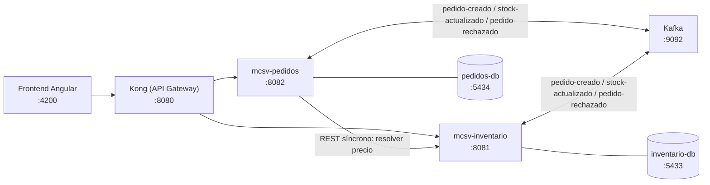

# Reto 2 — Sistema de Pedidos e Inventario

Arquitectura de microservicios event-driven: portal Angular, **Kong** como API
Gateway, dos microservicios Quarkus (Pedidos e Inventario) comunicados vía
Apache Kafka, cada uno con su propia base de datos PostgreSQL. Los dos
backends están migrados a **arquitectura hexagonal (ports & adapters)**, y
todo el sistema —incluido el frontend— corre dockerizado con un solo
`docker compose up`.

Para el detalle técnico de la arquitectura (diagramas, flujo de eventos,
decisiones de diseño) ver **[docs/ARQUITECTURA.md](docs/ARQUITECTURA.md)**, y
para el esquema de las bases de datos (tablas, migraciones Flyway, mapeo
entidad↔dominio) ver **[docs/BASE_DE_DATOS.md](docs/BASE_DE_DATOS.md)**.

## Arquitectura (resumen)



- **frontend**: portal Angular (catálogo, crear pedido, mis pedidos). Ver
  [frontend/portal-pedidos-inventario/README.md](frontend/portal-pedidos-inventario/README.md).
- **Kong**: único punto de entrada HTTP. Solo enruta y aplica CORS — sin
  lógica de negocio — vía config declarativa en [kong/kong.yml](kong/kong.yml)
  (modo DB-less).
- **mcsv-pedidos**: crea y consulta pedidos; al crear uno, resuelve el precio
  vigente de cada item con una llamada REST síncrona a `mcsv-inventario`
  (para no confiar en un precio mandado por el cliente), y publica el evento
  `pedido-creado`. Ver [mcsv-pedidos/README.md](mcsv-pedidos/README.md).
- **mcsv-inventario**: consume `pedido-creado`, valida y descuenta stock,
  publica `stock-actualizado` o `pedido-rechazado`. Ver
  [mcsv-inventario/README.md](mcsv-inventario/README.md).

Cada uno de los dos backends sigue el mismo esquema de paquetes hexagonal
(`domain` / `application` / `infrastructure`) — explicado en profundidad en
[docs/ARQUITECTURA.md](docs/ARQUITECTURA.md).

## Requisitos

- Docker + Docker Compose (para correr todo, incluidos los microservicios y el frontend)
- Java 21+ y Maven 3.9+ (solo si vas a correr algún servicio en modo
  desarrollo con `mvn quarkus:dev` fuera de Docker)
- Node.js 18+ y Angular CLI (solo si vas a correr el frontend con `npm start` fuera de Docker)

## Cómo levantar el proyecto

### Opción A — Todo en Docker (recomendada)

```bash
docker compose up -d --build
```

Levanta los 8 contenedores: infraestructura + los 2 microservicios + Kong +
el frontend, todos compilados dentro de sus propias imágenes (build
multi-stage, no requiere Maven/JDK/Node en el host — ver
[docs/ARQUITECTURA.md](docs/ARQUITECTURA.md#arquitectura-de-contenedores)).

| Servicio | Puerto host | Descripción |
|---|---|---|
| frontend | 4200 | Portal Angular (Nginx sirviendo el build de producción) |
| kong | 8080 | API Gateway — punto único de entrada REST (proxy) |
| kong (admin) | 8001 | Admin API de Kong, solo para inspección (`curl localhost:8001/routes`) |
| mcsv-inventario | 8081 | Microservicio de inventario |
| mcsv-pedidos | 8082 | Microservicio de pedidos |
| Kafka | 9092 | Broker (modo KRaft, sin Zookeeper) |
| Kafka UI | 8090 | http://localhost:8090 — inspección visual de tópicos/mensajes |
| pedidos-db | 5434 | PostgreSQL, base `pedidos` (5432 se evita: puede chocar con un PostgreSQL nativo local) |
| inventario-db | 5433 | PostgreSQL, base `inventario` |

Abre **http://localhost:4200** — no hace falta ningún paso adicional.

### Opción B — Infraestructura en Docker + servicios en modo dev

Útil para iterar sobre el código de un servicio con *live reload*
(`quarkus:dev` / `ng serve`), sin reconstruir imágenes Docker.

```bash
docker compose up -d kafka kafka-ui pedidos-db inventario-db
```

Luego, cada microservicio en su propia terminal (usa `localhost` para
Kafka/DB, tal como está en su `application.properties`):

```bash
cd mcsv-inventario && mvn quarkus:dev -Dquarkus.http.port=8081
cd mcsv-pedidos    && mvn quarkus:dev -Dquarkus.http.port=8082
```

Y el frontend, con *live reload* de Angular:

```bash
cd frontend/portal-pedidos-inventario
npm install
npm start
```

> Nota: en este modo, `environment.ts` apunta a `http://localhost:8080`
> (Kong), pero la config declarativa de `kong/kong.yml` enruta a los
> hostnames internos de Docker (`mcsv-pedidos:8080`, `mcsv-inventario:8080`),
> no a `localhost:8081`/`8082`. Para probar contra los servicios en modo dev
> sin reconstruir la imagen de Kong, apunta el frontend directo a ellos, o
> ajusta temporalmente las URLs en `kong/kong.yml` — Kong en modo DB-less
> recarga el archivo al reiniciar el contenedor
> (`docker compose restart kong`). En Docker "todo en contenedores" (Opción
> A) esto no aplica: los hostnames internos ya resuelven correctamente.
> Detalle en
> [docs/ARQUITECTURA.md](docs/ARQUITECTURA.md#arquitectura-de-contenedores).

## Endpoints principales

### mcsv-inventario (interno :8081 / vía Kong `/api/productos`)

- `GET /productos` — listar productos (`id, nombre, descripcion, precio, stock, sku, marca, categoria`)
- `GET /productos/{id}` — detalle de un producto
- Swagger UI en `/q/swagger-ui`

### mcsv-pedidos (interno :8082 / vía Kong `/api/pedidos`)

- `POST /pedidos` — crear pedido (`{ clienteId, items: [{ productoId, cantidad }] }`, **sin
  precio**: `mcsv-pedidos` resuelve `precioUnitario` con una llamada REST síncrona a
  `mcsv-inventario` antes de persistir, así el precio nunca queda en manos del cliente)
- `GET /pedidos` — listar (filtro opcional `?clienteId=`)
- `GET /pedidos/{id}` — detalle de un pedido (incluye `motivoRechazo` si fue rechazado)
- Swagger UI en `/q/swagger-ui`

### Kong (punto de entrada del frontend, :8080)

Solo enruta — sin lógica de negocio — vía config declarativa en
[kong/kong.yml](kong/kong.yml) (modo DB-less, sin Postgres propio):

- `/api/productos` → `mcsv-inventario:8080/productos` (pass-through)
- `/api/pedidos` → `mcsv-pedidos:8080/pedidos` (pass-through)
- Plugin `cors` habilitado para `http://localhost:4200`
- Admin API en `:8001` (`curl http://localhost:8001/routes`), solo para inspección

`nombreProducto`, `subtotal` y `total` (que antes agregaba un api-gateway a
medida) ahora los calcula el **frontend**, cruzando la respuesta de
`mcsv-pedidos` con el catálogo que ya tiene cargado — ver
[pedido.service.ts](frontend/portal-pedidos-inventario/src/app/services/pedido.service.ts).

### frontend (puerto 4200)

- Portal Angular en http://localhost:4200 (catálogo, crear pedido, mis pedidos, detalle)
- Consume `mcsv-pedidos` y `mcsv-inventario` a través de Kong vía `HttpClient`
  (`environment.apiGatewayUrl`)
- Como no hay WebSocket/SSE, el estado CREADO → CONFIRMADO/RECHAZADO se refleja con
  *polling* corto (cada 1.5 s) sobre `GET /api/pedidos/{id}` mientras el pedido esté pendiente

## Estado del proyecto

- [x] Fase 0 — Infraestructura base (docker-compose, repo)
- [x] Fase 1 — mcsv-inventario (modelo + endpoints de lectura)
- [x] Fase 2 — mcsv-pedidos (crear/consultar pedidos)
- [x] Fase 3 — Integración Kafka (pedido-creado → validación de stock)
- [x] Fase 4 — mcsv-pedidos consume eventos de stock/rechazo
- [x] Fase 5 — API Gateway (Kong, config declarativa DB-less; reemplazó a un api-gateway
      Quarkus a medida — el precio de cada pedido se resuelve ahora en `mcsv-pedidos`)
- [x] Fase 6 — Integración con frontend Angular
- [x] Fase 7 — Refactor a arquitectura hexagonal (ports & adapters) en los 2 backends
- [x] Fase 8 — Dockerización completa (microservicios + Kong + frontend + infraestructura)
- [ ] Fase 9 — Tests unitarios (pendiente; los ports dejan la lógica de negocio lista para mockear dependencias)
- [x] Fase 10 — Documentación final ([docs/ARQUITECTURA.md](docs/ARQUITECTURA.md) + README por servicio)
