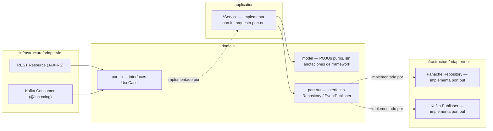
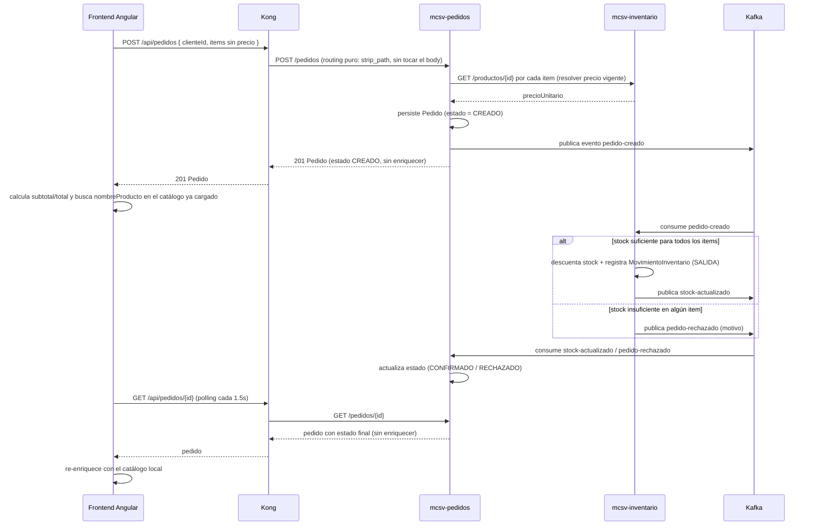
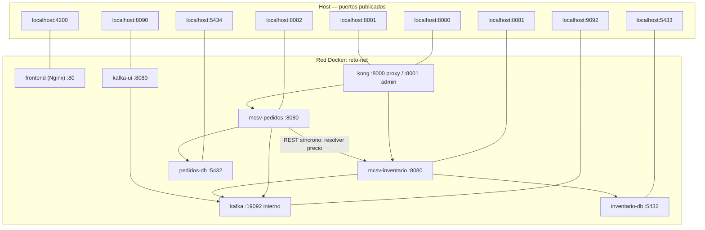

# Arquitectura del sistema

Este documento explica en detalle cómo está construido el sistema de Pedidos e
Inventario: el patrón de arquitectura hexagonal aplicado a los dos
microservicios Java/Quarkus, cómo Kong enruta el tráfico del frontend hacia
ellos, el flujo de eventos entre ellos vía Kafka, y cómo se organiza todo en
contenedores Docker. Está pensado como material de apoyo para sustentar el
proyecto.

## Índice

- [Visión general](#visión-general)
- [Arquitectura hexagonal (ports & adapters)](#arquitectura-hexagonal-ports--adapters)
- [Flujo de eventos entre servicios](#flujo-de-eventos-entre-servicios)
- [Contratos Kafka](#contratos-kafka)
- [Decisiones de diseño y trade-offs](#decisiones-de-diseño-y-trade-offs)
- [Arquitectura de contenedores](#arquitectura-de-contenedores)

Para el esquema de las bases de datos (tablas, migraciones Flyway, mapeo
entidad JPA ↔ modelo de dominio) ver **[BASE_DE_DATOS.md](BASE_DE_DATOS.md)**,
documento aparte para no sobrecargar este.

## Visión general

El sistema resuelve un flujo de e-commerce simplificado: un cliente arma un
pedido desde el frontend, el pedido se crea de forma asíncrona (no bloqueante)
contra el inventario, y su estado transiciona de `CREADO` a `CONFIRMADO` o
`RECHAZADO` según haya stock disponible. Hay dos servicios backend detrás de
un API Gateway:

| Servicio | Responsabilidad | Persistencia | Habla Kafka |
|---|---|---|---|
| **Kong** (API Gateway) | Único punto de entrada para el frontend; solo enruta (`/api/pedidos` → `mcsv-pedidos`, `/api/productos` → `mcsv-inventario`) y aplica CORS — sin lógica de negocio, config declarativa en [`kong/kong.yml`](../kong/kong.yml) | No tiene | No |
| `mcsv-pedidos` | Crea y consulta pedidos; dueño del ciclo de vida del pedido; resuelve el precio de cada item con una llamada REST síncrona a `mcsv-inventario` al crear el pedido | PostgreSQL `pedidos` | Publica `pedido-creado`; consume `stock-actualizado` y `pedido-rechazado` |
| `mcsv-inventario` | Dueño del catálogo y el stock; valida y descuenta inventario | PostgreSQL `inventario` | Consume `pedido-creado`; publica `stock-actualizado` y `pedido-rechazado` |

Kong no es una aplicación Java: es infraestructura configurada
declarativamente, no código propio. Los dos backends sí son proyectos
**Quarkus 3.37.4 / Java 21** independientes (sin módulo Maven raíz), cada uno
migrado a **arquitectura hexagonal** para separar la lógica de negocio de los
detalles de framework (JAX-RS, Panache/Hibernate, Kafka, REST clients).

> **Por qué Kong no resuelve precios ni enriquece respuestas.** El diseño
> anterior tenía un `api-gateway` Quarkus a medida que, además de enrutar,
> consultaba el catálogo para resolver `precioUnitario` al crear un pedido y
> agregaba `nombreProducto`/`subtotal`/`total` al listar — es decir, tenía
> lógica de negocio. Un API Gateway no debería componer datos de dos
> microservicios en una respuesta; eso es responsabilidad de quien consume la
> API o del propio servicio dueño de la operación. Por eso, al migrar a Kong
> (que solo puede enrutar/transformar, no orquestar llamadas), esa lógica se
> repartió: la resolución del precio —que si se confía en el cliente es un
> problema de integridad, no solo de estilo— pasó a `mcsv-pedidos` (que ya es
> quien decide si el pedido se acepta), y el enriquecimiento puramente visual
> pasó al frontend, que ya tiene todos los datos para calcularlo sin pedidos
> adicionales.

## Arquitectura hexagonal (ports & adapters)

Antes del refactor, los dos servicios seguían el patrón **Active Record +
Transaction Script**: los `Resource` (controllers JAX-RS) y los consumidores
Kafka manipulaban directamente las entidades Panache, mezclando transporte,
persistencia y reglas de negocio en la misma clase. No había interfaces de
repositorio ni casos de uso explícitos.

El mismo esquema de paquetes se aplicó en los dos servicios:

**Regla de dependencia**: las flechas de código siempre apuntan hacia adentro
(`domain`). Los adapters (`infrastructure`) conocen al dominio porque
implementan sus interfaces (`port.in`, `port.out`), pero el dominio nunca
importa nada de `infrastructure`, JAX-RS, Panache o Kafka. Esto es lo que
permite, por ejemplo, testear un caso de uso con JUnit + Mockito sin levantar
Quarkus (mockeando los ports), aunque en este proyecto se priorizó primero la
reestructuración y se dejaron los tests como trabajo pendiente (ver
[README](../README.md)).

**`application` es Java puro, sin CDI.** A diferencia de un wiring típico de
Quarkus (anotar cada implementación `@ApplicationScoped` y dejar que ArC la
inyecte donde el tipo del puerto aparezca como parámetro), aquí las clases de
`application/*Service` **no tienen ninguna anotación de framework** — ni
`@ApplicationScoped`, ni `@Transactional`, ni logging. Son clases planas cuyo
constructor solo recibe interfaces de `domain/port/out`. Quien sí es un bean
CDI gestionado es el adapter de entrada (`PedidoResource`,
`EstadoPedidoConsumer`, `ProductoResource`, `PedidoCreadoConsumer`): su
constructor inyecta los puertos de salida (implementados por los adapters de
persistencia/Kafka/REST client, esos sí `@ApplicationScoped`) y compone el
use case a mano con `new` — ver por ejemplo
[`PedidoResource`](../mcsv-pedidos/src/main/java/com/reto/pedidos/infrastructure/adapter/in/rest/PedidoResource.java).
Esto empuja *todo* el acoplamiento a un framework hacia `infrastructure`,
dejando `domain` y `application` con cero imports fuera de `java.*` y del
propio paquete `com.reto.*`.

`@Transactional` sigue el mismo criterio: vive en el método del adapter que
invoca el use case (no en `application`), porque el interceptor JTA de
Quarkus envuelve igual todas las escrituras hechas transitivamente durante
esa invocación, aunque las clases intermedias no sean beans CDI — ver la
sección de [demarcación transaccional](#decisiones-de-diseño-y-trade-offs)
más abajo.

### Cómo aplica en cada servicio

| Servicio | Casos de uso (`domain/port/in`) | Puertos de salida (`domain/port/out`) |
|---|---|---|
| `mcsv-pedidos` | `CrearPedidoUseCase`, `ConsultarPedidosUseCase`, `ActualizarEstadoPedidoUseCase` | `PedidoRepository`, `PedidoEventPublisher`, `CatalogoPort` (resuelve el precio contra `mcsv-inventario` vía REST client) |
| `mcsv-inventario` | `ProcesarPedidoCreadoUseCase`, `ConsultarProductosUseCase` | `ProductoRepository`, `MovimientoInventarioRepository`, `InventarioEventPublisher` |

`ProcesarPedidoCreadoUseCase` merece mención aparte: es el caso de uso con más
lógica de negocio del sistema (antes vivía completo dentro de un `@Incoming`
Kafka consumer) — valida stock, descuenta inventario, registra movimientos y
decide qué evento publicar. Ver
[`ProcesarPedidoCreadoService`](../mcsv-inventario/src/main/java/com/reto/inventario/application/ProcesarPedidoCreadoService.java).

## Flujo de eventos entre servicios

Puntos clave de este flujo:

- La creación del pedido es **síncrona hasta `CREADO`**: el cliente recibe
  201 de inmediato con el pedido en estado `CREADO`. La confirmación o el
  rechazo llegan de forma **asíncrona** vía Kafka.
- La llamada de `mcsv-pedidos` a `mcsv-inventario` para resolver el precio es
  la **única dependencia síncrona entre los dos microservicios** — todo lo
  demás (confirmación de stock, rechazo) sigue siendo asíncrono vía Kafka. Es
  deliberado: el precio hay que conocerlo *antes* de aceptar el pedido, no
  puede resolverse después con un evento.
- `mcsv-inventario` valida **todos** los items del pedido antes de descontar
  **cualquiera** — si un solo producto no tiene stock, el pedido completo se
  rechaza y no se toca el inventario de los demás items (ver
  [`ProcesarPedidoCreadoService`](../mcsv-inventario/src/main/java/com/reto/inventario/application/ProcesarPedidoCreadoService.java)).
- Kong nunca toca el cuerpo de la petición/respuesta: el JSON que manda el
  frontend y el que devuelve `mcsv-pedidos` son el mismo que atraviesa Kong.
  El enriquecimiento (`nombreProducto`, `subtotal`, `total`) es puramente del
  lado del frontend — ver
  [`pedido.service.ts`](../frontend/portal-pedidos-inventario/src/app/services/pedido.service.ts).
- El frontend no usa WebSocket/SSE: hace *polling* corto sobre
  `GET /api/pedidos/{id}` mientras el pedido esté en `CREADO`.

## Contratos Kafka

| Topic | Canal saliente | Canal entrante | Productor | Consumidor | Payload |
|---|---|---|---|---|---|
| `pedido-creado` | `pedido-creado-out` | `pedido-creado-in` | mcsv-pedidos | mcsv-inventario | `{ pedidoId, clienteId, items: [{ productoId, cantidad }] }` |
| `stock-actualizado` | `stock-actualizado-out` | `stock-actualizado-in` | mcsv-inventario | mcsv-pedidos | `{ pedidoId }` |
| `pedido-rechazado` | `pedido-rechazado-out` | `pedido-rechazado-in` | mcsv-inventario | mcsv-pedidos | `{ pedidoId, motivo }` |

Estos contratos (nombres de topic, de canal y shape JSON) **no cambiaron**
durante el refactor a hexagonal — solo se reubicaron las clases de evento
dentro de `infrastructure/adapter/{in,out}/messaging/event`. Cada evento
sigue existiendo como una copia independiente en cada módulo (no hay un
módulo Maven compartido de eventos); es una limitación conocida, aceptable
para el alcance del proyecto.

## Decisiones de diseño y trade-offs

**1. Dominio (POJOs) separado de las entidades Panache.** Panache usa el
patrón Active Record (`Pedido.persist()`, `Producto.findById()` como métodos
estáticos), lo cual es imposible de esconder detrás de una interfaz de puerto
sin que el dominio termine dependiendo de `PanacheEntityBase`. Por eso cada
servicio tiene un modelo de dominio (`domain/model`, POJOs planos) y una
entidad de persistencia aparte (`infrastructure/adapter/out/persistence/*Entity`),
con un mapper estático entre ambos. El costo es boilerplate (una clase mapper
por agregado); el beneficio es que el dominio no sabe que existe Hibernate.

**2. Dónde vive la demarcación transaccional (`@Transactional`).** `domain` y
`application` son Java puro (ver sección de wiring más arriba), así que
`@Transactional` vive siempre en `infrastructure`, en el punto que preserva
exactamente el comportamiento original de cada flujo:
   - En `mcsv-pedidos`, `@Transactional` está en
     [`EstadoPedidoConsumer`](../mcsv-pedidos/src/main/java/com/reto/pedidos/infrastructure/adapter/in/messaging/EstadoPedidoConsumer.java)
     (`onStockActualizado`/`onPedidoRechazado`). No basta con el
     `@Transactional` propio de `PanachePedidoRepository.guardar()`: la
     *lectura* previa (`buscarPorId`, vía Panache) también necesita una
     sesión/transacción activa, y un consumer Kafka —a diferencia de un
     request REST, que sí tiene un contexto CDI implícito por petición— no la
     tiene por defecto. Sin este `@Transactional` falla con
     `ContextNotActiveException` (se detectó justamente así, en pruebas
     end-to-end contra Kong, tras haber quitado la anotación por error al
     mover el wiring fuera de `application`).
   - En `mcsv-inventario`, `@Transactional` está en
     [`PedidoCreadoConsumer.onPedidoCreado()`](../mcsv-inventario/src/main/java/com/reto/inventario/infrastructure/adapter/in/messaging/PedidoCreadoConsumer.java)
     (el adapter Kafka de entrada, no en `ProcesarPedidoCreadoService`),
     porque ahí varias operaciones (descontar stock de N productos + registrar
     N movimientos, cada una sin `@Transactional` propio) deben confirmarse
     como una sola unidad atómica. El interceptor JTA envuelve igual todas
     las escrituras hechas transitivamente durante esa invocación, aunque
     `ProcesarPedidoCreadoService` sea una clase plana sin CDI.

**3. Algoritmo de dos pasadas en `ProcesarPedidoCreadoService`.** Primero se
valida el stock de *todos* los items del pedido; solo si todos pasan, se
ejecuta una segunda pasada que descuenta stock y registra movimientos. Esto
evita dejar el inventario a medio descontar si un item a mitad de la lista no
tiene stock suficiente.

**4. Orden de migración a hexagonal: api-gateway → mcsv-pedidos →
mcsv-inventario.** El `api-gateway` original (hoy reemplazado por Kong, ver
más abajo) no tenía Kafka ni base de datos (solo REST-a-REST), así que
sirvió para validar el patrón de paquetes con el menor riesgo. `mcsv-pedidos`
introdujo persistencia y Kafka con un dominio simple. Se dejó
`mcsv-inventario` — el que tiene la lógica de negocio más rica — para el
final, una vez validado el patrón dos veces.

**5. Kong reemplazó al `api-gateway` a medida.** El `api-gateway` original
hacía dos cosas de negocio (resolver precio, enriquecer respuesta) que no
pertenecen a un API Gateway y que Kong no puede hacer (no compone datos de
dos servicios). En vez de mantener un servicio Java solo para eso, se optó
por: (a) reemplazar el gateway por Kong en modo **DB-less** — la config de
rutas vive versionada en [`kong/kong.yml`](../kong/kong.yml), sin Postgres
propio ni cambios en caliente por Admin API, lo cual es más simple de operar
y de explicar que un gateway con código propio; y (b) repartir la lógica que
Kong no puede hacer entre quien sí debe tenerla — ver el recuadro en
[Visión general](#visión-general).

**6. Compatibilidad de contratos.** En ningún momento cambiaron los contratos
REST (mismo JSON de request/response hacia el frontend y entre servicios) ni
los contratos Kafka (mismos topics/canales/payloads). El refactor es
puramente interno: reorganiza *cómo* se implementa el comportamiento, no *qué*
comportamiento expone el sistema.

## Arquitectura de contenedores

Todo el sistema —Kafka, las dos bases de datos, los dos microservicios, Kong
y el frontend Angular— corre en contenedores Docker sobre una red común
(`reto-net`), definidos en [`docker-compose.yml`](../docker-compose.yml). Con
`docker compose up -d --build` no queda nada corriendo fuera de Docker.

**El frontend es un caso especial en este diagrama**: aunque `frontend` vive
en la red `reto-net` como cualquier otro contenedor, sus llamadas a la API
**no viajan por esa red**. El navegador del usuario (fuera de Docker por
completo) es quien ejecuta el JavaScript de Angular, y ese JavaScript pide
`http://localhost:8080` directamente — el puerto publicado de **Kong**
(su puerto de proxy interno, `8000`, mapeado a `8080` en el host — el mismo
que usaba el `api-gateway` original) en el host. Por eso el frontend no
necesita ningún override de variable de entorno (a diferencia de los dos
backends Java): `environment.ts` sigue apuntando a `localhost` sin importar
si el frontend corre en Docker o con `ng serve`.

Puntos clave para defender esta parte:

- **Dos listeners de Kafka**: `PLAINTEXT://kafka:19092` para tráfico
  *dentro* de la red Docker (lo usan `mcsv-pedidos` y `mcsv-inventario`) y
  `PLAINTEXT_HOST://localhost:9092` para clientes desde el host (por ejemplo,
  si se quisiera correr un servicio en modo `quarkus:dev` fuera de Docker).
- **Los contenedores de Postgres exponen 5432 puertas adentro** (el puerto
  estándar), pero se publican al host en `5434` (pedidos) y `5433`
  (inventario) para no chocar con un PostgreSQL nativo que pudiera estar
  corriendo en el `5432` del host.
- **Los dos microservicios reciben overrides por variable de entorno**
  (`QUARKUS_DATASOURCE_JDBC_URL`, `KAFKA_BOOTSTRAP_SERVERS`,
  `QUARKUS_REST_CLIENT_MCSV_INVENTARIO_URL` en `mcsv-pedidos`, etc.) en
  `docker-compose.yml`, en vez de tener el hostname de Docker hardcodeado en
  `application.properties`. Así el mismo `application.properties` (con
  `localhost`) sigue sirviendo para desarrollo local con `mvn quarkus:dev`, y
  Docker Compose sobrescribe esos valores solo cuando corre en contenedores.
- **Kong no tiene overrides por variable de entorno**: su config
  (`kong/kong.yml`) ya usa los hostnames de Docker directamente
  (`http://mcsv-pedidos:8080/pedidos`, etc.) porque solo corre dentro de
  Compose — no tiene un equivalente a "modo dev local" como los
  microservicios Java.
- **Build multi-stage**: cada microservicio tiene su propio `Dockerfile` con
  dos etapas — una imagen `maven` que compila el jar, y una imagen runtime
  liviana (`ubi9/openjdk-21-runtime`) que solo contiene el artefacto ya
  compilado. Esto permite `docker compose up --build` de forma autocontenida,
  sin depender de tener Maven/JDK instalados en el host.
- **El frontend sigue el mismo patrón de build multi-stage**, adaptado a su
  stack: una imagen `node` corre `npm ci` + `ng build` (modo producción), y la
  imagen final es `nginx:alpine` sirviendo únicamente los archivos estáticos
  generados — no queda Node.js en el contenedor que corre en producción.
  Nginx además hace `try_files ... /index.html` para que el ruteo del lado del
  cliente de Angular (Angular Router) funcione al recargar cualquier ruta.
