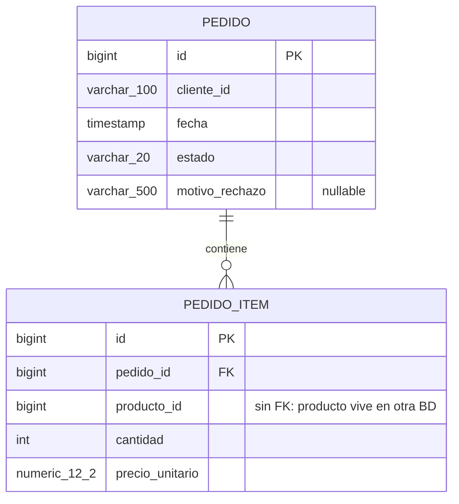
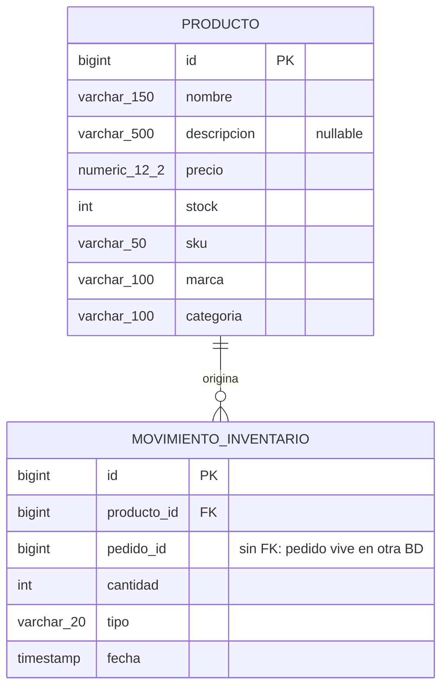

# Base de datos

Este documento complementa [ARQUITECTURA.md](ARQUITECTURA.md) con el detalle de
persistencia: qué esquema tiene cada base, cómo se versiona, y cómo se conecta
con el resto del código (entidades JPA vs modelo de dominio).

## Visión general

Cada microservicio tiene **su propia base PostgreSQL 16**, sin excepciones —
es la regla más básica de "microservicio dueño de sus datos": ningún servicio
hace `JOIN` ni consulta directamente la base de otro.

| | `mcsv-pedidos` | `mcsv-inventario` |
|---|---|---|
| Base | `pedidos` | `inventario` |
| Contenedor | `pedidos-db` | `inventario-db` |
| Puerto host | `5434` | `5433` |
| Puerto interno (red Docker) | `5432` | `5432` |
| Usuario/password | `pedidos`/`pedidos` | `inventario`/`inventario` |
| Imagen | `postgres:16-alpine` | `postgres:16-alpine` |

Los puertos host (`5434`, `5433`) son distintos de `5432` a propósito: `5432`
se evita porque puede chocar con un PostgreSQL nativo corriendo en el host.
*Dentro* de la red Docker (`reto-net`) cada contenedor sigue escuchando en el
`5432` estándar — el mapeo a un puerto distinto es solo para acceder desde
fuera de Docker (por ejemplo, un cliente SQL en el host, o un microservicio
corriendo en modo `quarkus:dev` fuera de contenedores).

## Migraciones: Flyway, no Hibernate

Las dos bases se versionan con **Flyway** (`quarkus.flyway.migrate-at-start=true`,
scripts en `src/main/resources/db/migration`), y Hibernate tiene
`quarkus.hibernate-orm.database.generation=validate` — es decir, **Hibernate
nunca crea ni altera tablas**, solo valida al arrancar que las entidades JPA
coincidan con lo que Flyway ya dejó en la base (si no coinciden, la app falla
al iniciar en vez de "arreglarlo" silenciosamente). Flyway es la única fuente
de verdad del esquema.

Cada migración es un archivo `V<n>__<descripción>.sql` plano, sin ningún DSL:

| Servicio | Migración | Qué hace |
|---|---|---|
| `mcsv-pedidos` | `V1__init.sql` | Crea `pedido` y `pedido_item` + índices |
| `mcsv-pedidos` | `V2__motivo_rechazo.sql` | Agrega `pedido.motivo_rechazo` |
| `mcsv-inventario` | `V1__init.sql` | Crea `producto` y `movimiento_inventario` + índice + **seed** de 5 productos |
| `mcsv-inventario` | `V2__producto_atributos_frontend.sql` | Renombra `stock_disponible`→`stock`, agrega `sku`/`marca`/`categoria` (necesarios para el catálogo del frontend) |

El seed de productos vive en `V1__init.sql` de `mcsv-inventario` — por eso el
catálogo tiene datos reales apenas levantas el stack, sin ningún paso manual.

## Esquema — `pedidos`



- `pedido.estado` es `VARCHAR`, no un `ENUM` de Postgres — el enum vive del
  lado de Java (`EstadoPedido`), mapeado con `@Enumerated(EnumType.STRING)`
  en [`PedidoEntity`](../mcsv-pedidos/src/main/java/com/reto/pedidos/infrastructure/adapter/out/persistence/PedidoEntity.java).
  Guardar el nombre (`"CREADO"`) y no el ordinal (`0`) es deliberado: si el
  día de mañana reordenas o insertas un valor en el enum, los datos ya
  guardados no cambian de significado.
- `pedido_item.pedido_id` **sí** tiene FK real (`ON DELETE CASCADE`): borrar
  un pedido borra sus items, porque ambas tablas viven en la misma base y
  `PedidoItem` no tiene sentido de vida propio fuera de un `Pedido` (es un
  *value object* del agregado, en términos DDD).
- `pedido_item.producto_id` **no** tiene FK — apunta a un producto que vive
  en la base de `mcsv-inventario`, una base de datos completamente distinta.
  Postgres no puede validar esa referencia (no hay FK entre bases en
  arquitecturas de microservicios); la integridad ahí la garantiza el
  *proceso* (mcsv-pedidos resuelve el precio contra mcsv-inventario antes de
  guardar, ver [CrearPedidoService](../mcsv-pedidos/src/main/java/com/reto/pedidos/application/CrearPedidoService.java)),
  no una constraint de base de datos.
- Índices: `idx_pedido_cliente` (para `GET /pedidos?clienteId=`) y
  `idx_pedido_item_pedido` (para traer los items de un pedido).

## Esquema — `inventario`



- `movimiento_inventario` es un **log de auditoría**: cada vez que se
  descuenta stock por un pedido confirmado, se inserta una fila (nunca se
  actualiza ni se borra) — ver
  [`MovimientoInventario.salida(...)`](../mcsv-inventario/src/main/java/com/reto/inventario/domain/model/MovimientoInventario.java)
  y [`ProcesarPedidoCreadoService`](../mcsv-inventario/src/main/java/com/reto/inventario/application/ProcesarPedidoCreadoService.java).
  Por ahora solo existe el tipo `SALIDA` (el enum `TipoMovimiento` deja lugar
  a `ENTRADA` para una futura reposición de stock, no implementada).
- `movimiento_inventario.producto_id` sí tiene FK (mismo razonamiento que
  `pedido_item.pedido_id`: viven en la misma base). `pedido_id` **no** tiene
  FK — mismo caso que `pedido_item.producto_id` antes, pero al revés: acá el
  pedido es el que vive en la otra base.
- `producto.stock` se actualiza *in place* (`UPDATE`, no un evento contable)
  — es el valor "vivo" del stock; `movimiento_inventario` es el historial de
  *por qué* llegó a ese valor, no la fuente de verdad del stock actual.

## Cómo se conecta con el código: entidad JPA ≠ modelo de dominio

Ya lo mencionamos en [ARQUITECTURA.md](ARQUITECTURA.md#decisiones-de-diseño-y-trade-offs),
pero vale verlo con las columnas reales delante: cada tabla tiene **dos**
representaciones en Java, nunca una sola.

| Tabla (Postgres) | Entidad JPA (`infrastructure/adapter/out/persistence`) | Modelo de dominio (`domain/model`) |
|---|---|---|
| `pedido` | `PedidoEntity` — `@Entity`, `PanacheEntityBase`, campos públicos con anotaciones JPA | `Pedido` — POJO con campos **privados** + getters/setters, sin ninguna anotación |
| `producto` | `ProductoEntity` | `Producto` |

La entidad JPA sabe de columnas, `@Column`, `@OneToMany`, `PanacheEntityBase`
(active record: `.persist()`, `.findById()`). El modelo de dominio no sabe
que existe una tabla. El mapeo entre ambos es manual y explícito, en clases
`*PersistenceMapper` de solo dos métodos estáticos (`toDomain`/`toEntities`)
— por ejemplo
[`PedidoPersistenceMapper`](../mcsv-pedidos/src/main/java/com/reto/pedidos/infrastructure/adapter/out/persistence/PedidoPersistenceMapper.java).
Ambas entidades extienden `PanacheEntityBase` (no `PanacheEntity`) porque
`PanacheEntity` ya trae un campo `id` propio — acá se prefirió declarar el
`@Id` a mano en cada entidad, para tener control explícito sobre su mapeo
(`@GeneratedValue(strategy = GenerationType.IDENTITY)`, que en Postgres se
traduce a `BIGSERIAL`).

## Configuración por entorno

Igual que el resto de la config (ver [ARQUITECTURA.md](ARQUITECTURA.md#arquitectura-de-contenedores)):
el `application.properties` de cada servicio trae la URL de **desarrollo
local** (`localhost:5434`/`localhost:5433`, los puertos publicados al host),
y `docker-compose.yml` la sobreescribe con el hostname interno de Docker vía
variable de entorno cuando corre en contenedores:

```properties
# mcsv-pedidos/src/main/resources/application.properties (dev local)
quarkus.datasource.jdbc.url=jdbc:postgresql://localhost:5434/pedidos
```
```yaml
# docker-compose.yml, servicio mcsv-pedidos (override solo en Docker)
QUARKUS_DATASOURCE_JDBC_URL: jdbc:postgresql://pedidos-db:5432/pedidos
```

Así el mismo código corre igual con `mvn quarkus:dev` (contra el Postgres
publicado en el host) o dentro de `docker compose up` (contra el hostname
interno `pedidos-db`), sin tocar una sola línea.

## Verificación rápida (para la entrevista)

Si te piden mostrar el esquema en vivo, con el stack levantado:

```bash
docker exec -it pedidos-db psql -U pedidos -d pedidos -c "\dt"
docker exec -it inventario-db psql -U inventario -d inventario -c "\dt"
```

O, para ver el historial de migraciones que aplicó Flyway:

```bash
docker exec -it pedidos-db psql -U pedidos -d pedidos -c "SELECT version, description, success FROM flyway_schema_history;"
```
